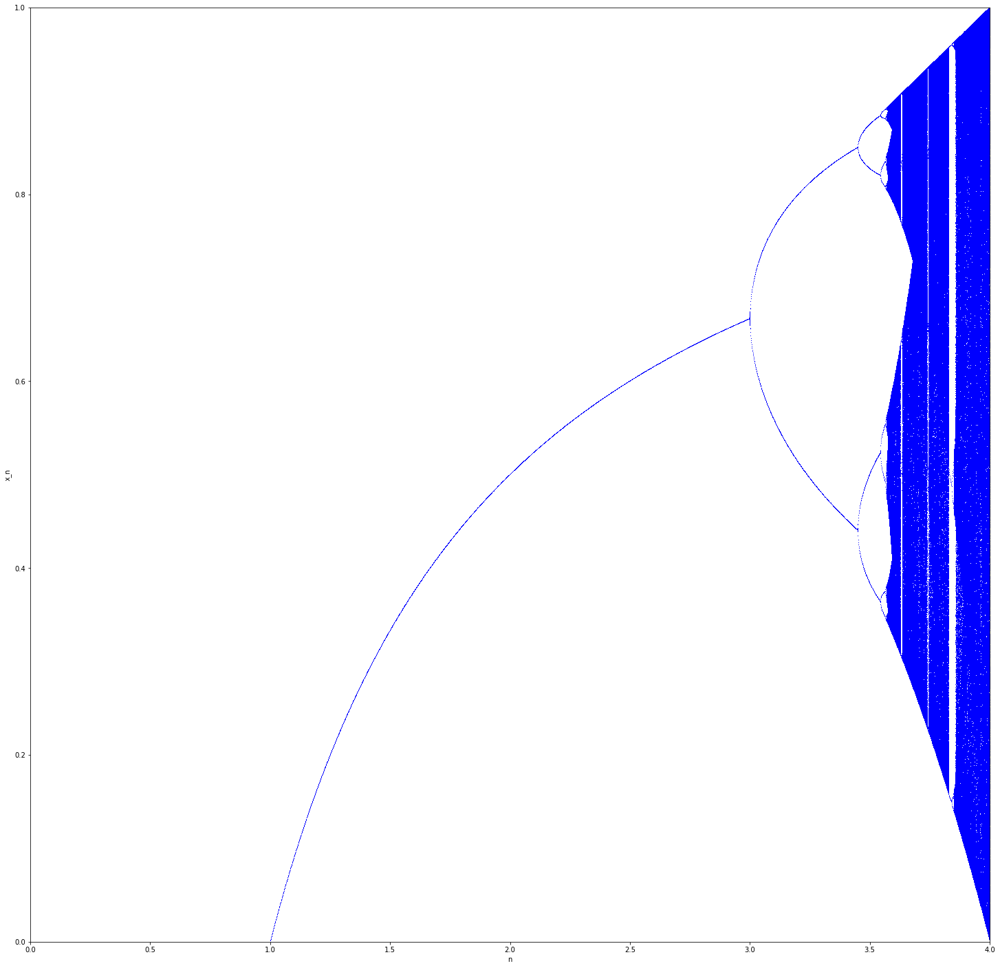

# Algoritmos_aprendidos

### Ecuacion de Feigenbaum

- Mas sobre la ecuacion [Ecuacion de Feigembaum:](https://es.wikipedia.org/wiki/Aplicaci%C3%B3n_log%C3%ADstica)

- Ecuacion :  

- [codigo](./CodeFeigenbaum/Feigenbaum2.py)

- [Video](https://www.youtube.com/watch?v=ovJcsL7vyrk&t=2s)

- 

### Regresion Lineal 

- [codigo](./lineal/linearRegressionAlgorithm.ipynb)

### Constante de dezplamiento de Wien

- [codigo](./Curso_Metodos_Numericos_2020_I/codigos_antes_parcial/Constante_desplazamiento_wien.ipynb)

### Interpolación Numerica 

- [codigo](./Curso_Metodos_Numericos_2020_I/codigos_antes_parcial/Interpolacion_numerica.ipynb)

### Metodos Directos

- [codigo](./Curso_Metodos_Numericos_2020_I/codigos_antes_parcial/METODOS_DIRECTOS.ipynb)

### Metodos Iterativos

- [codigo](./Curso_Metodos_Numericos_2020_I/codigos_antes_parcial/Metodods_Iterativos.ipynb)

### Minimos Cuadrados

- [codigo](./Curso_Metodos_Numericos_2020_I/codigos_antes_parcial/Minimos_Cuadrados.ipynb)

### EDP

- [codigo](./Curso_Metodos_Numericos_2020_I/codigos_despues_del_parcial/EDP.ipynb)

### Ecuaciones diferenciales de Primer Orden

- [Codigo](./Curso_Metodos_Numericos_2020_I/codigos_despues_del_parcial/Ecuaciones_diferenciales_de_primer_orden.ipynb)

### Integración Numerica

- [codigo](./Curso_Metodos_Numericos_2020_I/codigos_despues_del_parcial/Integracion_numerica.ipynb)

### Integración Numerica II Y Derivadas

- [codigo](./Curso_Metodos_Numericos_2020_I/codigos_despues_del_parcial/Integracion_numerica_II_ y_derivadas.ipynb)

### Problemas con condiciones de Frontera

- [codigo](./Curso_Metodos_Numericos_2020_I/codigos_despues_del_parcial/Prob_cond_de_frontera.ipynb)
